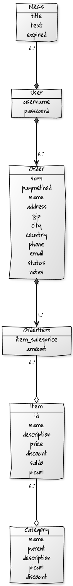

<h1>SHOP</h1>

<pre>
Mini-verkkokauppa konfiguroitu korujen myyntiin.
Vielä Alpha-versio, ei tuotantoon valmis!

Sovelluksella voi kuka tahansa selata kuvallista 
tuotekataloogia ja tilata tuotteita itsepalveluna.
Käyttäjien sessiot ovat tilapäisiä, myöhemmin lisätään
toiminnallisuus että käyttäjälle lähetään linkki 
sähköpostiin jolla hän löytää vanhat tilauksensa.

Admin voi lisätä ja muokata kategoroita ja tuotteita
ja vastaanottaa tilauksia sähköpostitse. Tilauksissa 
ostaja maksaa ensin ja admin hoitaa tuotteen lähettämisen.

Admin-moodi 
pystyy periaattessa muokkaamaan melkein mitä vaan
www-littymästä mutta sessioiden kanssa on vielä 
säätöä. Admin-käyttäjätunnus luodaan tietokantaan 
User-modeliin.

<h3>Asennus</h3>
Vaatii rails-tuntemusta. Koko projektikansio shop pyöräytetään käytiin 
rails 2.35(ruby 1.87)-sovelluksena.

Editoi tarpeen mukaan seuraavia tiedostoja shop-kansion alla:
config/environment.rb / config/environments/*
config/database.yml

#suojaus ja sessiot
app/controllers/application_controller.rb #kohta 'yourwebhost.com' 
#kannattaa muuttaa railsin apache-reverseproxyn nimeksi jos 
#sellaista käyttää. Tämä jos virheilee se printaa envin logiin 

#sähköpostinlähetys
lib/Smailer.rb
app/controllers/orders_controller.rb
#tää kohta: Smailer.send_email("admin@localhost", @opts) 

Tuotekategoriat on valmiiksi valitut mutta niitä voi vaihtaa
laittamalla admin-sivuilla tai tietokantaan Categorioita.
Ylävalikkoa voi puukottaa sijainnissa
app/views/layouts/_navigation.html.erb

<h3>Testaus</h3>
Automaattitestausta ei ole vielä tehty koodin eläessä kovasti, 
kaikki testaus toistaiseksi pääkehittäjän toimesta
käsin Firefoxilla ja Chromiumilla.

<h3>Demo</h3>
Demo hetkellisesti osoitteessa http://artannika.com/shop/items
Saa leikkiä.

Admin-moodiin saattaa päästä osoittessa http://artannika.com/shop/users
jos se on saatu toimimaan. Ktunnus "admin" ssana "p"

<h3>Tulevaisuus</h3>
Sessionhallinnan bugit ja tietosuoja ja users-tietoturva korjataan, 
uutispalsta tulee etusivulle,
admin-puolta ja logitusta viilataan, headeriin ja footeriin tulee
firman logoja ja tekstejä,
ydintoiminnan yksikkötestit tehdään regressiotesteiksi ja sovellus
laitetaan tuotantoon ihmisten testattavaksi.
</pre>

